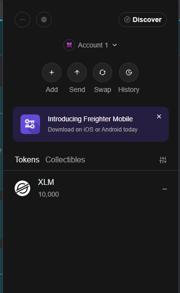
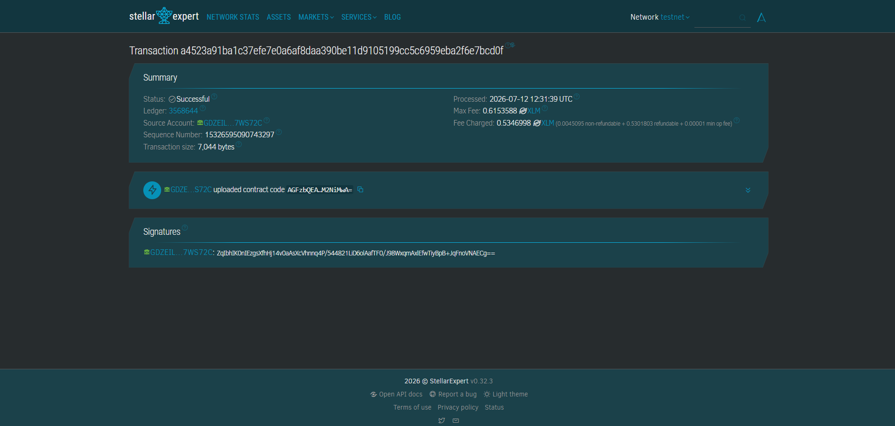

# HarvestPay

Instant, trustless escrow for smallholder farmer-to-trader harvest sales, built on Stellar/Soroban.

## Problem

Rosa, a smallholder rice farmer in Nueva Ecija, Philippines, delivers her harvest to local traders who routinely delay payment by 2–4 weeks for "verification." That delay forces her to borrow at predatory interest rates just to cover inputs for the next planting cycle.

## Solution

Before delivery, the trader funds a Soroban escrow contract with USDC. The instant the trader confirms receipt of Rosa's harvest (e.g. by scanning a QR code at the trading post), the contract releases the funds directly to Rosa's wallet — no bank float, no paperwork delay, no counterparty risk on either side.

## Timeline (hackathon build)

- **Day 1:** Contract design, `create_escrow` / `confirm_delivery` / `cancel_escrow` implemented and unit tested
- **Day 2:** Testnet deployment, USDC trustline setup, CLI demo script
- **Day 3:** Minimal wallet UI (QR-based confirm flow) + live demo polish

## Stellar features used

- USDC transfers via a Stellar asset / anchor-issued token
- Soroban smart contract for escrow logic and state
- Trustlines (USDC on both farmer and buyer wallets)

## Vision and purpose

Rural agricultural trade in Southeast Asia still runs on paper receipts and delayed bank transfers, which quietly taxes the farmers who can least afford it. HarvestPay replaces that delay with programmable trust: funds move the moment goods change hands, verifiable by anyone, reversible by no one. The long-term vision is a network of local anchors letting farmers cash out directly to mobile money (e.g. GCash) without ever touching crypto UX.

## Prerequisites

- Rust (stable) with the `wasm32-unknown-unknown` target
- Soroban CLI v21+ (`cargo install --locked soroban-cli`)
- A funded Stellar testnet account (via [Friendbot](https://friendbot.stellar.org))

## Setup Instructions (Run Locally)

### 1. Clone the repository

```bash
git clone <repository-url>
cd harvest_pay
```

### 2. Install dependencies

Ensure you have Rust installed with the WebAssembly target:

```bash
rustup target add wasm32-unknown-unknown
```

Install Soroban CLI:

```bash
cargo install --locked soroban-cli
```

### 3. Build the contract

```bash
cd contracts/harvet_pay
soroban contract build
```

This generates the WASM file at `target/wasm32-unknown-unknown/release/harvestpay.wasm`.

### 4. Run tests

```bash
cargo test
```

### 5. Deploy to Stellar Testnet

Configure your Stellar testnet identity (if not already done):

```bash
soroban keys generate --global <YOUR_IDENTITY_NAME> --network testnet
```

Fund your account via Friendbot:

```bash
soroban keys fund <YOUR_IDENTITY_NAME> --network testnet
```

Deploy the contract:

```bash
soroban contract deploy \
  --wasm target/wasm32-unknown-unknown/release/harvestpay.wasm \
  --source <YOUR_IDENTITY_NAME> \
  --network testnet
```

## Live Testnet Deployment

The contract has been successfully deployed to Stellar testnet:

**Contract Address:** `CDYJHR5IO4D7G5ZFCDYR4JVXJAAJ5GHC5IJ74HY7CO547XAOMIYS6DYN`

### Deployment Transactions

**Upload WASM Transaction:**
- Transaction Hash: `a4523a91ba1c37efe7e0a6af8daa390be11d9105199cc5c6959eba2f6e7bcd0f`
- 🔗 [View on Stellar Expert](https://stellar.expert/explorer/testnet/tx/a4523a91ba1c37efe7e0a6af8daa390be11d9105199cc5c6959eba2f6e7bcd0f)

**Deploy Contract Transaction:**
- Transaction Hash: `9d0b1b5aa2e31725085e3555dec11107bfc3888b8be18c8a1fd68e13d5690946`
- WASM Hash: `b639aecc3630a3922332aefa78509051173fe5218c810f7797e77b1e63cb042f`
- 🔗 [View on Stellar Expert](https://stellar.expert/explorer/testnet/tx/9d0b1b5aa2e31725085e3555dec11107bfc3888b8be18c8a1fd68e13d5690946)
- 🔗 [View Contract on Stellar Lab](https://lab.stellar.org/r/testnet/contract/CDYJHR5IO4D7G5ZFCDYR4JVXJAAJ5GHC5IJ74HY7CO547XAOMIYS6DYN)

## Sample CLI Usage

### Create an escrow

```bash
soroban contract invoke \
  --id CDYJHR5IO4D7G5ZFCDYR4JVXJAAJ5GHC5IJ74HY7CO547XAOMIYS6DYN \
  --source <BUYER_IDENTITY> \
  --network testnet \
  -- \
  create_escrow \
  --buyer <BUYER_ADDRESS> \
  --farmer <FARMER_ADDRESS> \
  --token <USDC_TOKEN_ADDRESS> \
  --amount 5000000000
```

### Confirm delivery and release funds

Once the harvest is delivered:

```bash
soroban contract invoke \
  --id CDYJHR5IO4D7G5ZFCDYR4JVXJAAJ5GHC5IJ74HY7CO547XAOMIYS6DYN \
  --source <BUYER_IDENTITY> \
  --network testnet \
  -- \
  confirm_delivery \
  --escrow_id 0 \
  --buyer <BUYER_ADDRESS>
```

### Cancel an escrow

If the delivery is rejected or doesn't happen:

```bash
soroban contract invoke \
  --id CDYJHR5IO4D7G5ZFCDYR4JVXJAAJ5GHC5IJ74HY7CO547XAOMIYS6DYN \
  --source <BUYER_IDENTITY> \
  --network testnet \
  -- \
  cancel_escrow \
  --escrow_id 0 \
  --buyer <BUYER_ADDRESS>
```

## Screenshots

### Wallet Connected State & Balance Display



**Freighter Wallet** showing:
- ✅ **Account 1** connected
- 💰 **10,000 XLM** balance displayed
- Wallet actions available: Add, Send, Swap, History
- Ready for testnet contract interactions

### Successful Testnet Deployment



**Deployment terminal output** showing:
```
✅ Transaction submitted successfully!
🔗 https://stellar.expert/explorer/testnet/tx/a4523a91ba1c37efe7e0a6af8daa390be11d9105199cc5c6959eba2f6e7bcd0f

ℹ️  Deploying contract using wasm hash b639aecc3630a3922332aefa78509051173fe5218c810f7797e77b1e63cb042f
✅ Transaction submitted successfully!
🔗 https://stellar.expert/explorer/testnet/tx/9d0b1b5aa2e31725085e3555dec11107bfc3888b8be18c8a1fd68e13d5690946

✅ Deployed!
CDYJHR5IO4D7G5ZFCDYR4JVXJAAJ5GHC5IJ74HY7CO547XAOMIYS6DYN
```

## License

MIT